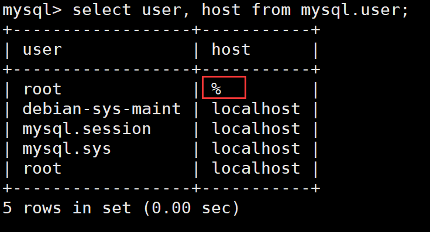
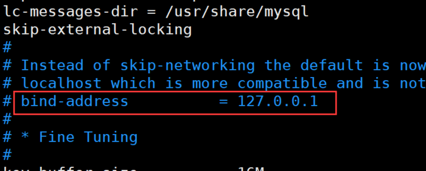
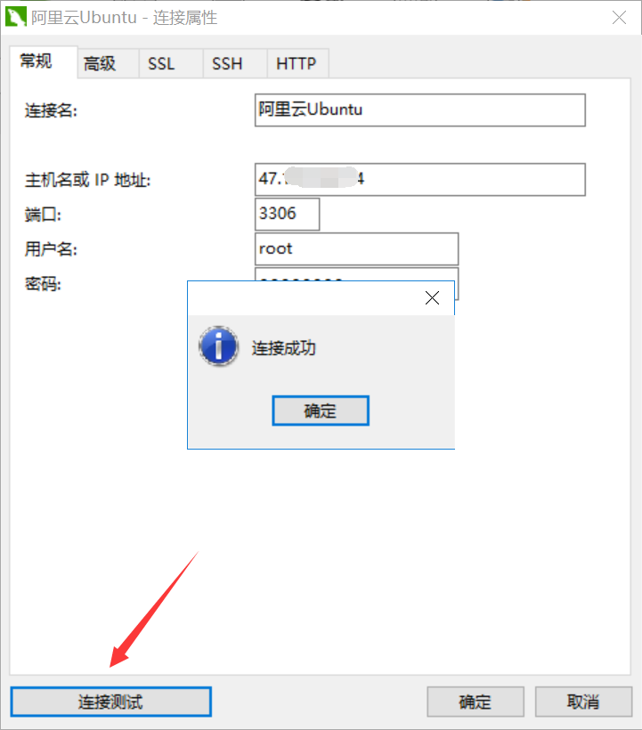

## Ubuntu安装MySQL

### 1、更新源地址
sudo apt-get update

### 2、安装mysql
sudo apt-get install mysql-server

**安装过程中会提示设置密码**

### 3、运行远程连接mysql
	
	mysql -uroot -p #连接mysql，后面会提示输入mysql密码
	
	mysql> GRANT ALL PRIVILEGES ON *.* TO 'root'@'%' IDENTIFIED BY 'mysql密码' WITH GRANT OPTION;

	mysql> flush privileges;  # 重新加载mysql权限

查询修改是否成功：root用户host多了个%，成功

### 4、关闭bind-address

如果完成上面第3步设置，还是无法通过navcat远程连接mysql，需要将/etc/mysql/mysql.conf.d/mysqld.cnf 文件中下面这行注释掉：

	bind-address = 127.0.0.1

### 5、重启mysql服务，navcat连接mysql

通过下面命令重启mysql：

	sudo service mysql restart

navcat测试连接：

