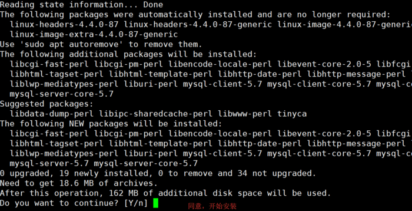
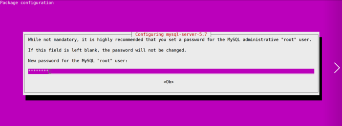
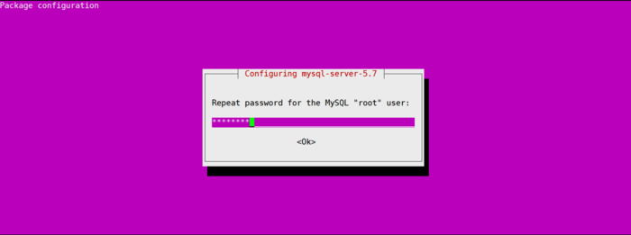

## Ubuntu安装MySQL

### 1、更新源地址
sudo apt-get update

### 2、安装mysql
sudo apt-get install mysql-server

**安装过程中会提示设置密码**

### 3、运行远程连接mysql
	
	mysql -uroot -p #连接mysql，后面会提示输入mysql密码
	
	mysql> GRANT ALL PRIVILEGES ON *.* TO 'root'@'%' IDENTIFIED BY 'mysql密码' WITH GRANT OPTION;

	mysql> flush privileges;  # 重新加载mysql权限